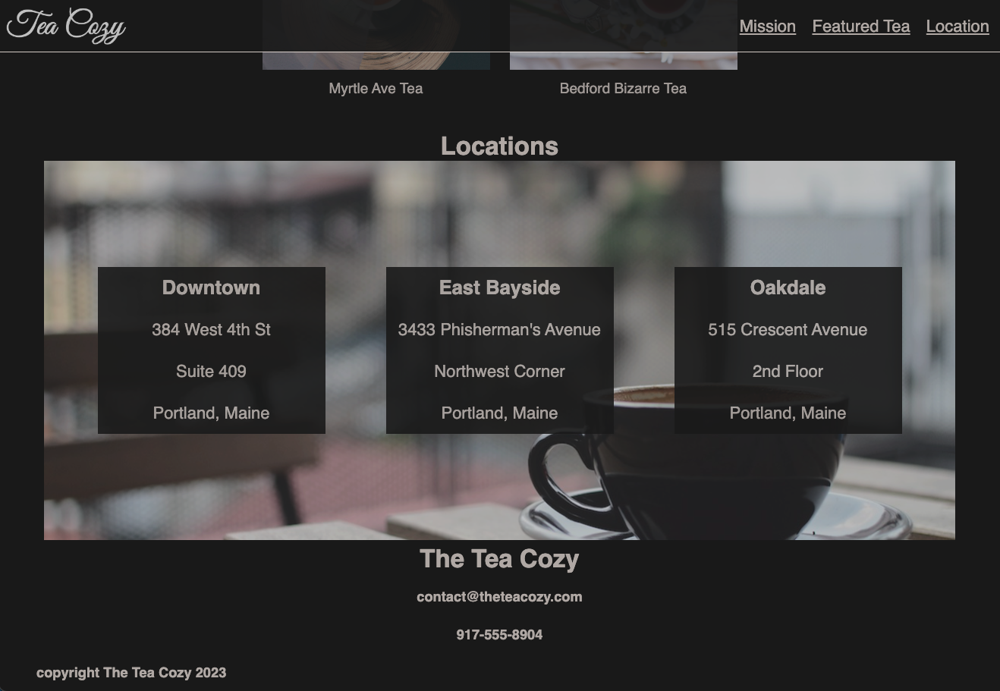

# Off-Platform Project: Tea Cozy
This is one of the projects Codeacademy provided during the full stack engineer career path. The project/website only consists of HTML and CSS languages. The idea of the project was to implement these languages' fundamentals into the website.

 
 
 
